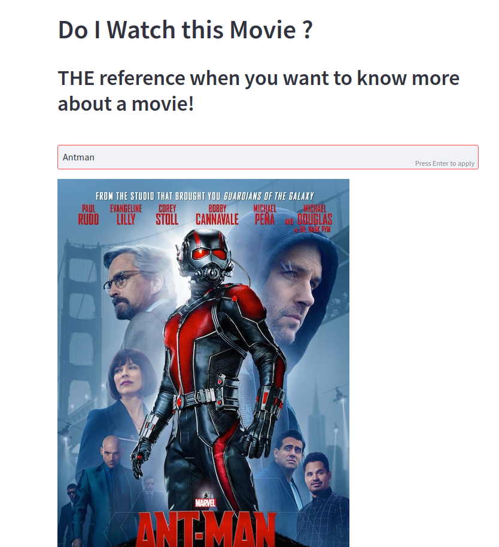

# Welcome to my API project named : **Do I Watch This Movie ?**

The goal of this project is to create an application related with movie search using IMDB movie search API.

## 1. Description of the application

The application I decided to implement is an app that allows the user to get more information about a movie.  
Imagining you are with your friends at home on a Friday night and you want to watch a movie but you don't really know what to watch. Everybody around you is proposing movie name that you have never heard before...

## Here is when **Do I Watch This Movie ?** app comes in !

You can try it directly here : https://doiwatchthismovie.streamlit.app/

- You can learn everything about our app here : [Presentation](https://github.com/antoinergr/API_Project/documentation/App_presentation.pdf)

## 2. Demo : 



## 3. Let's get started

### Install the packages necessary to start the app:

```python
    pip3 install -r requirements.txt
```

### Run the app locally :

```python
    python -m streamlit run app.py
```
Now your app should be launched in your localhost.